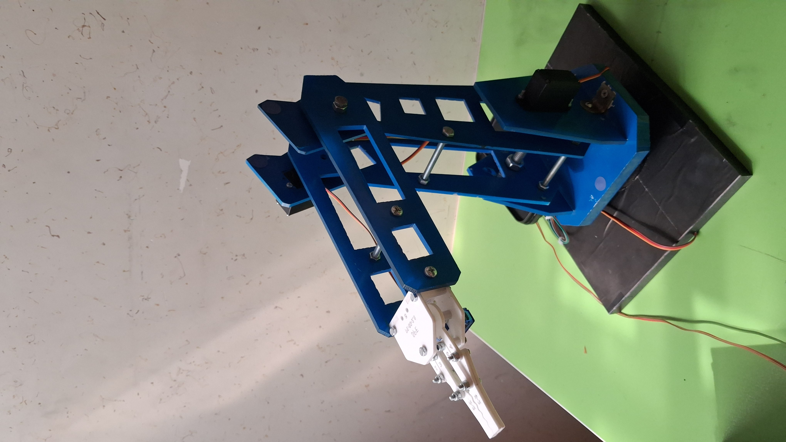

# Blue-Arm

3-DOF RRR robotic arm with MATLAB kinematics, Python control, and ESP32 Arduino firmware.
# Blue Arm
## Overview
## Repository Structure
- `MATLAB/` — Mathematical modeling, kinematics, dynamics and simulation
- `ESP32/` — Robot firmware
- `Application/` — Robot control application
- `Images/` — Robot and experimental images
- `Documentation/` — Project report and technical documents
## Project Objectives

## Robot Specifications

## Mechanical Structure

## Mathematical Modeling

### Forward Kinematics

### Inverse Kinematics

### Dynamic Modeling

## Control System

## ESP32

## Application
A dedicated application was developed to communicate with the Blue Arm
robot and send control commands through the ESP32 communication interface.
## Communication

## MATLAB Simulation

## Experimental Results

## Project Images

## Documentation

## Installation and Usage

## Authors
